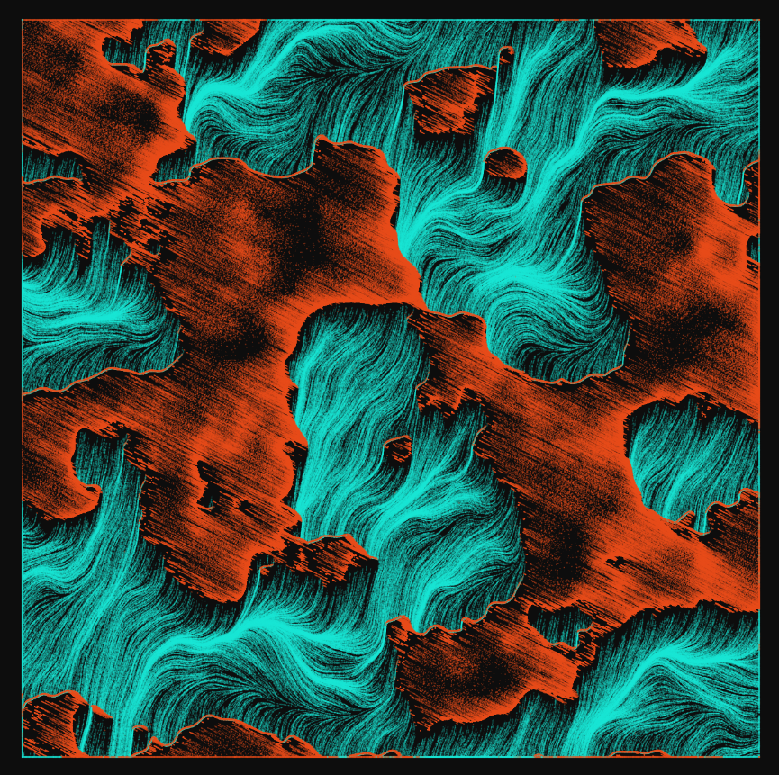
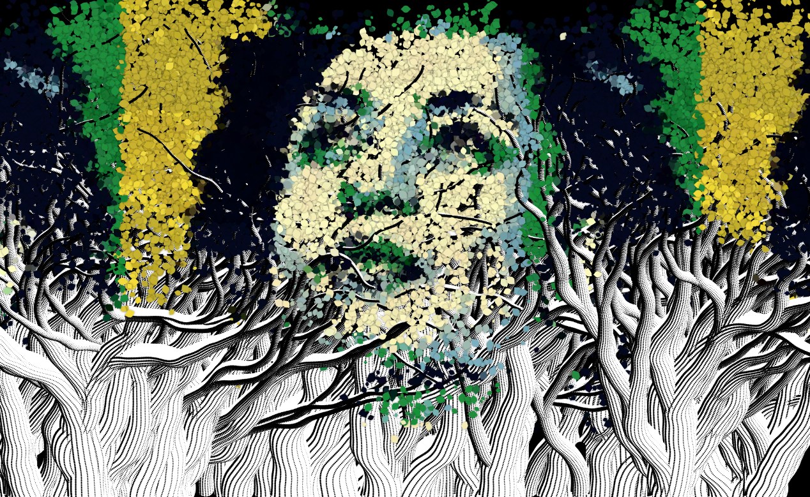
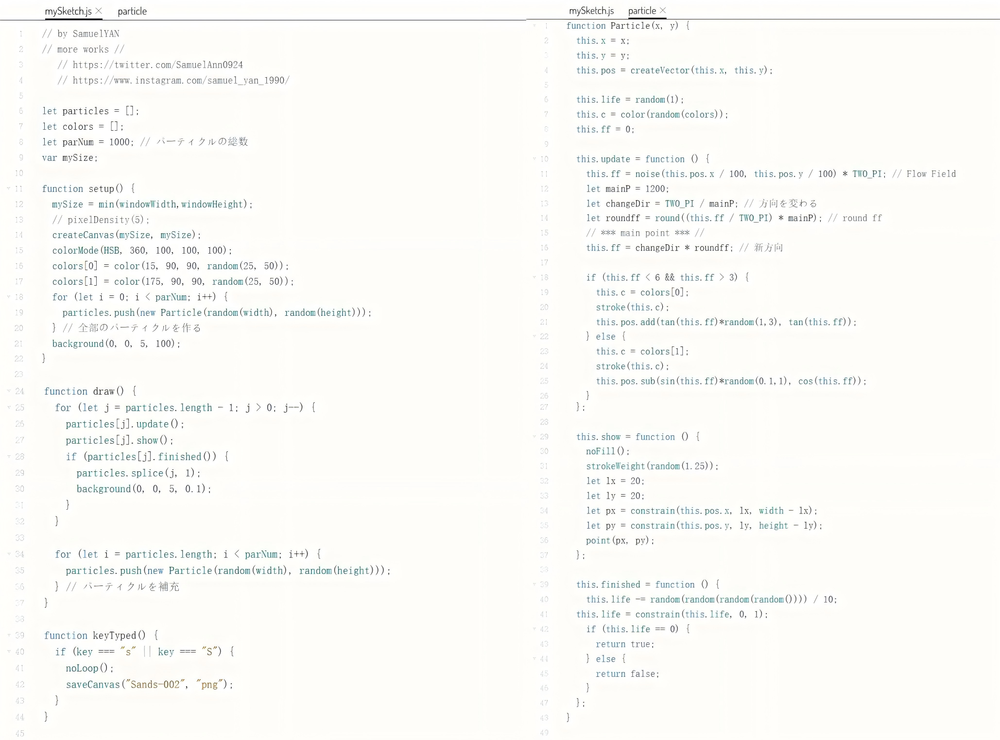
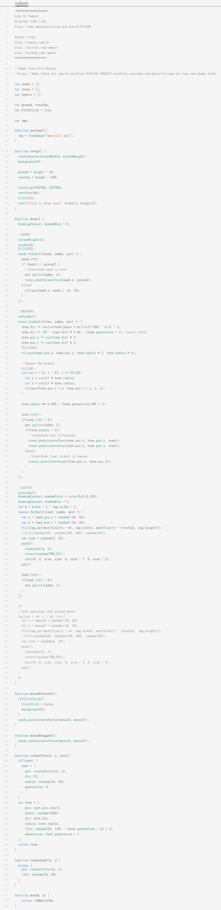

# xzha0812_9103_tut5_quiz8

## IDEA 9103 Quiz 8

**Imaging Technique Inspiration**

 
Figure 1 depicts the island by imitating the way water flows through the linear and arc-shaped movement of particles, while Figure 2 constructs a portrait of a woman through the process of plant growth. Therefore, I plan to adopt a similar particle movement mode in this assignment to draw the artwork. Specifically, the particles will diffuse outward according to the position of the mouse click and be graphically depicted. Also, I will combine keyboard input to add more interactive functions, such as controlling the zooming in, zooming out, or moving of graphics through keys, thereby enhancing the interactivity and fun.

    *Figure 1: Artwork 1*
    

    *Figure 2: Artwork 2*
    

**Coding Technique Exploration**

Using p5.js to build a particle system and controlling the movement trajectories of particles to draw dynamic images with a naturally flowing artistic effect. Referring to the tree growth logic in Figure 4 (createTree() function), particles can follow specific paths and use image pixel data (img.get()) to colour leaves. Both code examples demonstrate strong interactivity. Figure 3 shows keyboard input to stop the movement of particles and save the artwork, while in Figure 4, falling seeds are continuously generated through mouse click commands and loop logic. These methods will provide technical assistance for creating interactive and visually rich artistic works.
 
 *Figure 3：Code of Artwork 1*
 

 > This is a link for Artwork 1 with the code.
 https://openprocessing.org/sketch/1353598

 *Figure 4：Code of Artwork 2*
 
 
 > This is a link for Artwork 2 with the code.
 http://openprocessing.org/sketch/873380

 
